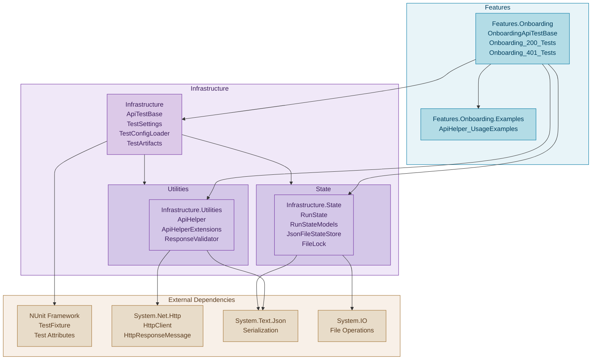
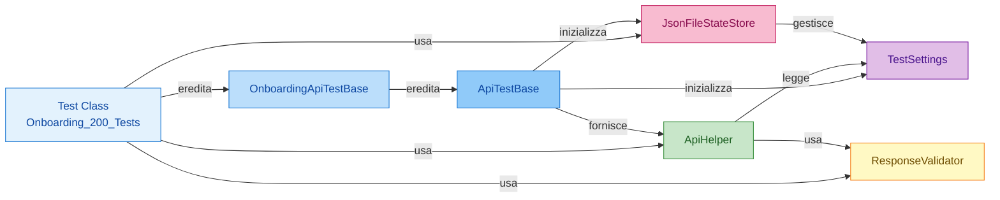

# Prove.AutomationTesting.BE - Documentazione Completa

## 📋 Panoramica

**Prove.AutomationTesting.BE** è una suite di test di automazione API per validare il comportamento degli endpoint backend. Il progetto è scritto in **C# con .NET 8** e utilizza il framework **NUnit** per la strutturazione e l'esecuzione dei test.

### Obiettivo principale
Fornire un framework robusto e modulare per testare le API backend, con:
- Gestione centralizzata della configurazione
- Utility helper per semplificare le operazioni HTTP
- Validazione delle risposte standardizzata
- Persistenza dello stato dei test tra le esecuzioni

---

## 🏛️ Architettura dei Namespaces

### Descrizione dei Namespaces Principali

| Namespace | Livello | Scopo | Contenuto |
|-----------|---------|-------|----------|
| `ApiTests.Infrastructure` | 0 (Root) | Base per tutti i test | `ApiTestBase`, `TestSettings`, `TestConfigLoader`, `TestArtifacts` |
| `ApiTests.Infrastructure.Utilities` | 1 | Helper e utility comuni | `ApiHelper`, `ApiHelperExtensions`, `ResponseValidator` |
| `ApiTests.Infrastructure.State` | 1 | Gestione dello stato persistente | `RunState`, `RunStateModels`, `JsonFileStateStore`, `FileLock` |
| `ApiTests.Features.Onboarding` | 1 | Feature Onboarding | `OnboardingApiTestBase`, `Onboarding_200_Tests`, `Onboarding_401_Tests` |
| `ApiTests.Features.Onboarding.Examples` | 2 | Esempi di utilizzo | `ApiHelper_UsageExamples` |

---

## Diagramma Dipendenze dei Package

Visualizzazione delle relazioni e dipendenze tra i package del progetto:



### Descrizione delle Dipendenze

**Flusso di Dipendenza (basso → alto):**

1. **Layer Esterno** (External Dependencies)
   - NUnit Framework: Attributi e framework per i test
   - System.Net.Http: Client HTTP e operazioni di rete
   - System.Text.Json: Serializzazione/deserializzazione
   - System.IO: Operazioni su file

2. **Layer Infrastruttura** (Infrastructure)
   - **Core** (ApiTestBase): Base per tutti i test, dipende da Framework esterno
   - **Utilities** (ApiHelper, ResponseValidator): Helper HTTP, dipende da HttpClient
   - **State** (JsonFileStateStore, RunState): Persistenza, dipende da File I/O e JSON

3. **Layer Feature** (Features)
   - **Onboarding** (OnboardingApiTestBase, Test classes): Test specifici del dominio
   - Dipende da tutto l'Infrastructure
   - **Onboarding.Examples**: Esempi di utilizzo, dipende da Onboarding

### Grafo di Uso



---

## 🏗️ Struttura del Progetto

```
Prove.AutomationTesting.BE/
├── Infrastructure/
│   ├── ApiTestBase.cs              # Classe base per tutti i test API
│   ├── TestSettings.cs             # Modello di configurazione strongly-typed
│   ├── TestConfigLoader.cs         # Caricamento della configurazione da appsettings
│   ├── TestArtifacts.cs            # Gestione dei fixture di test
│   ├── Utilities/
│   │   ├── ApiHelper.cs            # Helper per operazioni HTTP (GET, POST, PUT, DELETE)
│   │   ├── ApiHelperExtensions.cs  # Estensioni per ApiHelper
│   │   └── ResponseValidator.cs    # Utility per validare risposte HTTP
│   └── State/
│       ├── RunState.cs             # Modello dello stato persistente
│       ├── RunStateModels.cs       # Modelli per lo stato dei test
│       ├── JsonFileStateStore.cs   # Store persistente su file JSON
│       └── FileLock.cs             # Gestione dei lock per concorrenza
├── Features/
│   └── Onboarding/
│       ├── Onboarding_200_Tests.cs      # Test per validare risposte 200 OK
│       ├── Onboarding_401_Tests.cs      # Test per validare risposte 401 Unauthorized
│       ├── OnboardingApiTestBase.cs     # Base class specifica per test Onboarding
│       └── Examples/
│           └── ApiHelper_UsageExamples.cs  # Esempi di utilizzo dell'ApiHelper
├── appsettings.json                # Configurazione principale
├── appsettings.TestCases.json      # Fixture di test
├── README.md                       # Documentazione di base
└── solution-documentation.yml      # Documentazione di configurazione
```

---

## 🔧 Componenti Principali

### 1. **ApiTestBase** - Classe Base per i Test

Fornisce l'infrastruttura comune a tutti i test API.

#### Proprietà disponibili:

| Proprietà | Tipo | Descrizione |
|-----------|------|-------------|
| `Settings` | `TestSettings` | Configurazione dell'applicazione caricata da `appsettings.json` |
| `HttpClient` | `HttpClient` | Client HTTP preconfigurato con URL base e timeout |
| `DbConnectionString` | `string` | Stringa di connessione al database |
| `StateStore` | `JsonFileStateStore` | Store persistente per lo stato dei test |
| `RunState` | `RunState` | Stato corrente caricato dallo StateStore |

#### Utilizzo:
```csharp
[TestFixture]
public class MyTests : ApiTestBase
{
    [Test]
    public async Task MyTest()
    {
        var response = await HttpClient.GetAsync("/api/endpoint");
        Assert.That(response.StatusCode, Is.EqualTo(HttpStatusCode.OK));
    }
}
```

#### Hook di estensione:
```csharp
protected virtual void AfterApiSetUp()
{
    // Override per aggiungere logica specifica dopo l'inizializzazione
}
```

---

### 2. **TestSettings** - Configurazione Strongly-Typed

Mappa la configurazione da JSON in oggetti C# fortemente tipizzati, evitando stringhe "magiche" sparse nel codice.

#### Struttura gerarchica:

```
TestSettings
├── Env : string
├── Api : ApiSettings
│   ├── BaseUrl : string
│   ├── AcceptLanguage : string
│   └── TimeoutSeconds : int
├── Database : DatabaseSettings
│   └── ConnectionString : string
├── Onboarding : OnboardingSettings
│   └── DefaultDeviceId : string
└── TestCases : TestCasesSettings
    └── Auth : AuthTestCases
        ├── ExpiredToken : string
        ├── MalformedToken : string
        └── EmptyToken : string
```

#### Benefici:
- ✅ Type-safe (niente errori di digitazione)
- ✅ Intellisense completo nell'IDE
- ✅ Facile manutenzione della configurazione
- ✅ Centralizzazione dei parametri

---

### 3. **ApiHelper** - Utility per Operazioni HTTP

Semplifica le operazioni HTTP comuni nei test centralizzando la logica di request/response.

#### Metodi disponibili:

```csharp
// GET
public async Task<HttpResponseMessage> GetAsync(string endpoint)
public async Task<T> GetAsync<T>(string endpoint) where T : class

// POST
public async Task<HttpResponseMessage> PostAsync<TRequest>(string endpoint, TRequest body) where TRequest : class
public async Task<T> PostAsync<TRequest, T>(string endpoint, TRequest body) where TRequest : class, where T : class

// PUT
public async Task<HttpResponseMessage> PutAsync<TRequest>(string endpoint, TRequest body) where TRequest : class
public async Task<T> PutAsync<TRequest, T>(string endpoint, TRequest body) where TRequest : class, where T : class

// DELETE
public async Task<HttpResponseMessage> DeleteAsync(string endpoint)
```

#### Esempio di utilizzo:

```csharp
var apiHelper = new ApiHelper(HttpClient, Settings);

// GET semplice
var response = await apiHelper.GetAsync("/api/users");

// GET con deserializzazione
var users = await apiHelper.GetAsync<List<UserDto>>("/api/users");

// POST con body
var createRequest = new { Name = "John", Email = "john@example.com" };
var newUser = await apiHelper.PostAsync<CreateUserRequest, UserDto>("/api/users", createRequest);
```

#### Validazione automatica:
- Endpoint validation
- Serializzazione/deserializzazione JSON
- Gestione header (Content-Type, Accept-Language)

---

### 4. **ResponseValidator** - Validazione Risposte

Centralizza i controlli su status code, header e contenuto con un'interfaccia fluida.

#### Metodi disponibili:

```csharp
public ResponseValidator AssertIsSuccess()
    // Valida che la risposta sia 2xx

public ResponseValidator AssertStatusCode(HttpStatusCode expectedCode)
    // Valida uno status code specifico

public ResponseValidator AssertStatusCodeIsOneOf(params HttpStatusCode[] expectedCodes)
    // Valida uno tra più status code

public ResponseValidator AssertHeader(string headerName, string expectedValue)
    // Valida un header specifico

public ResponseValidator AssertContentType(string expectedContentType)
    // Valida il Content-Type
```

#### Pattern fluido:

```csharp
new ResponseValidator(response)
    .AssertStatusCode(HttpStatusCode.Created)
    .AssertContentType("application/json")
    .AssertHeader("X-Request-Id", "123");
```

#### Gestione errori:
Se una validazione fallisce, viene lanciata una `InvalidOperationException` con dettagli chiari:
```
"Status code atteso: 200 OK, ricevuto: 401 Unauthorized"
```

---

### 5. **JsonFileStateStore** - Persistenza dello Stato

Gestisce il caricamento e la persistenza dello stato dei test su file JSON, permettendo il passaggio di dati tra test.

#### Percorso dello store:
```
.teststate/RunState.json
```

#### Operazioni disponibili:

```csharp
// Caricamento dello stato
await StateStore.LoadAsync();

// Salvataggio dello stato
await StateStore.SaveAsync(runState);

// Accesso allo stato corrente
var currentState = StateStore.CurrentState;
```

#### Modello del RunState:

```csharp
public sealed class RunState
{
    public string? Env { get; set; }                           // Ambiente di esecuzione
    public string? BaseUrl { get; set; }                       // URL base dell'API
    public string UpdatedAtUtc { get; set; }                   // Timestamp ultimo aggiornamento
    public OnboardingState Onboarding { get; set; }            // Stato specifico Onboarding
}

public sealed class OnboardingState
{
    public string? DeviceId { get; set; }                      // ID dispositivo
    public string? SessionId { get; set; }                     // ID sessione
    public string? UserId { get; set; }                        // ID utente
    public TokenState Token { get; set; }                      // Token autenticazione
}
```

#### Concorrenza:
- Utilizza `FileLock` per evitare race condition
- Sicuro per esecuzioni parallele
- Gestione automatica dei lock

#### Esempio:
```csharp
[Test]
public async Task Test_With_Shared_State()
{
    // Lettura
    await StateStore.LoadAsync();
    var savedToken = RunState.Onboarding.Token.Value;
    
    // Modifica
    RunState.Onboarding.DeviceId = "new-device-123";
    RunState.Onboarding.SessionId = Guid.NewGuid().ToString();
    
    // Salvataggio
    await StateStore.SaveAsync(RunState);
}
```

---

## ⚙️ Configurazione

### appsettings.json - Configurazione Principale

Contiene i parametri di ambiente, connessione e timeout.

```json
{
  "Env": "Local",
  "Api": {
    "BaseUrl": "https://api.local:5000",
    "AcceptLanguage": "it-IT",
    "TimeoutSeconds": 30
  },
  "Database": {
    "ConnectionString": "Server=localhost;Database=TestDB;User Id=sa;Password=pass123;"
  },
  "Onboarding": {
    "DefaultDeviceId": "device-001"
  },
  "TestCases": {
    "Auth": {
      "ExpiredToken": "eyJhbGciOiJIUzI1NiIsInR5cCI6IkpXVCJ9...",
      "MalformedToken": "invalid-token-format",
      "EmptyToken": ""
    }
  }
}
```

#### Configurazioni per ambiente:

```json
// Development
{
  "Env": "Development",
  "Api": {
    "BaseUrl": "https://api.dev.example.com",
    "TimeoutSeconds": 60
  }
}

// Production
{
  "Env": "Production",
  "Api": {
    "BaseUrl": "https://api.prod.example.com",
    "TimeoutSeconds": 15
  }
}
```

### appsettings.TestCases.json - Fixture di Test

Contiene i dati per i test (token, endpoint, payload di esempio, ecc.).

```json
{
  "TestCases": {
    "Auth": {
      "ExpiredToken": "token-scaduto-da-env",
      "MalformedToken": "token-malformato",
      "EmptyToken": ""
    }
  }
}
```

#### Caricamento della configurazione:

```csharp
// In ApiTestBase
Settings = TestConfigLoader.Load();
// Legge appsettings.json e appsettings.TestCases.json
// Merge automatico con override di TestCases
```

---

## 📝 Suite di Test

### Onboarding_200_Tests

Testa il comportamento corretto dell'endpoint di Onboarding quando riceve richieste valide.

```csharp
[TestFixture]
public class Onboarding_200_Tests : OnboardingApiTestBase
{
    [Test]
    public async Task Should_Return_200_On_Valid_Request()
    {
        // Stub da implementare con:
        // 1. Richiesta HTTP POST a "/onboarding/start"
        // 2. Payload valido
        // 3. Asserzione su status code 200
    }
}
```

**Stato:** 🟡 **Stub da implementare**

**TODO:**
- [ ] Implementare payload reale
- [ ] Eseguire POST request
- [ ] Validare risposta 200
- [ ] Verificare body della risposta

### Onboarding_401_Tests

Testa il comportamento dell'endpoint di Onboarding quando riceve richieste non autorizzate.

**Scenari testati:**
- ✅ Token scaduto
- ✅ Token malformato
- ✅ Token assente
- ✅ Credenziali non valide

**Implementazione:**
```csharp
[TestFixture]
public class Onboarding_401_Tests : OnboardingApiTestBase
{
    [Test]
    public async Task Should_Return_401_With_Expired_Token()
    {
        var request = new HttpRequestMessage(HttpMethod.Get, "/api/onboarding")
        {
            Headers = 
            { 
                Authorization = new AuthenticationHeaderValue(
                    "Bearer", 
                    Settings.TestCases.Auth.ExpiredToken
                ) 
            }
        };
        
        var response = await HttpClient.SendAsync(request);
        new ResponseValidator(response).AssertStatusCode(HttpStatusCode.Unauthorized);
    }
}
```

---

## 🚀 Come Utilizzare

### 1. Esecuzione dei Test

#### Con Visual Studio:
```
Menu → Test → Esplora test → (seleziona test) → Esegui
```

#### Con Visual Studio Code:
```bash
dotnet test Prove.AutomationTesting.BE.csproj --verbosity normal
```

#### Con linea di comando PowerShell:
```bash
# Tutti i test
dotnet test

# Test specifico
dotnet test --filter "ClassName=Onboarding_200_Tests"

# Con output verbose
dotnet test --verbosity detailed

# Con coverage (richiede pacchetto coverage)
dotnet test /p:CollectCoverage=true
```

### 2. Creare un Nuovo Test

#### Template base:

```csharp
using NUnit.Framework;
using System.Threading.Tasks;

namespace ApiTests.Features.MyFeature;

/// <summary>
/// Suite di test per l'endpoint MyFeature.
/// </summary>
[TestFixture]
public class MyFeature_Tests : ApiTestBase
{
    [Test]
    public async Task Should_Return_200_With_Valid_Input()
    {
        // Arrange
        var apiHelper = new ApiHelper(HttpClient, Settings);
        var requestPayload = new { /* ... */ };
        
        // Act
        var response = await apiHelper.PostAsync<MyRequest, MyResponse>(
            "/api/myfeature/endpoint", 
            requestPayload
        );
        
        // Assert
        Assert.That(response.Id, Is.Not.Null);
        Assert.That(response.Status, Is.EqualTo("Success"));
    }
}
```

#### O estendi una base class specifica:

```csharp
public class MyFeature_Tests : OnboardingApiTestBase
{
    // Eredita configurazioni specifiche
}
```

### 3. Accesso allo Stato Persistente

```csharp
[Test]
public async Task MyTest_With_Persistence()
{
    // Setup: carica stato precedente
    await StateStore.LoadAsync();
    
    var previousToken = RunState.Onboarding.Token.Value;
    var previousUserId = RunState.Onboarding.UserId;
    
    // Esecuzione test...
    
    // Update: salva nuovo stato
    RunState.Onboarding.SessionId = Guid.NewGuid().ToString();
    await StateStore.SaveAsync(RunState);
}
```

### 4. Gestione degli Header

Gli header di default vengono configurati automaticamente:

```csharp
// Headers applicati automaticamente:
// - Accept-Language: it-IT (da Settings.Api.AcceptLanguage)
// - Content-Type: application/json (per POST/PUT)
// - Timeout: 30 secondi (da Settings.Api.TimeoutSeconds)

// Per header personalizzati:
var request = new HttpRequestMessage(HttpMethod.Get, "/api/endpoint")
{
    Headers = 
    {
        { "X-Custom-Header", "CustomValue" },
        { Authorization, new AuthenticationHeaderValue("Bearer", token) }
    }
};

var response = await HttpClient.SendAsync(request);
```

### 5. Gestione degli Errori

```csharp
[Test]
public async Task Should_Handle_Api_Errors()
{
    var apiHelper = new ApiHelper(HttpClient, Settings);
    
    try
    {
        await apiHelper.GetAsync<MyResponse>("/api/nonexistent");
    }
    catch (HttpRequestException ex)
    {
        Assert.That(ex.Message, Does.Contain("404"));
    }
}
```

---

## 🔐 Autenticazione e Token

### Token Test

I token di test sono configurati in `appsettings.TestCases.json`:

```json
{
  "TestCases": {
    "Auth": {
      "ExpiredToken": "eyJhbGc...",
      "MalformedToken": "invalid-token-format",
      "EmptyToken": ""
    }
  }
}
```

### Utilizzo nei Test

#### Pattern base:
```csharp
[Test]
public async Task Should_Return_401_With_Expired_Token()
{
    var endpoint = "/api/onboarding/validate";
    var token = Settings.TestCases.Auth.ExpiredToken;
    
    var request = new HttpRequestMessage(HttpMethod.Get, endpoint)
    {
        Headers = 
        {
            Authorization = new AuthenticationHeaderValue("Bearer", token)
        }
    };
    
    var response = await HttpClient.SendAsync(request);
    
    new ResponseValidator(response)
        .AssertStatusCode(HttpStatusCode.Unauthorized);
}
```

#### Con ApiHelper:
```csharp
[Test]
public async Task Should_Make_Authenticated_Request()
{
    var apiHelper = new ApiHelper(HttpClient, Settings);
    
    // Aggiungi token manualmente all'HttpClient prima di usare ApiHelper
    HttpClient.DefaultRequestHeaders.Authorization = 
        new AuthenticationHeaderValue("Bearer", validToken);
    
    var response = await apiHelper.GetAsync<UserDto>("/api/users/me");
    
    Assert.That(response.Id, Is.Not.Null);
}
```

---

## 📦 Dipendenze

### NuGet Packages

| Package | Versione | Utilizzo |
|---------|----------|----------|
| NUnit | 4.x | Framework di test |
| Microsoft.NET.Test.SDK | 18.x | SDK per test .NET 8 |
| NUnit3TestAdapter | 4.x | Adapter per VS |

### .NET Framework

- Target: **.NET 8.0**
- Linguaggio: **C# 12**

---

## 📂 File di Stato

### .teststate/RunState.json

File generato automaticamente durante l'esecuzione dei test. Contiene lo stato persistente tra le esecuzioni.

**Location:** `.teststate/RunState.json` (relativo alla cartella di lavoro)

**Contenuto di esempio:**
```json
{
  "Env": "Local",
  "BaseUrl": "https://api.local:5000",
  "UpdatedAtUtc": "2024-01-15T10:30:45.1234567Z",
  "Onboarding": {
    "DeviceId": "device-001",
    "SessionId": "session-abc123-xyz789",
    "UserId": "user-xyz789-abc123",
    "Token": {
      "Value": "eyJhbGciOiJIUzI1NiIsInR5cCI6IkpXVCJ9.eyJzdWIiOiIxMjM0NTY3ODkwIn0..."
    }
  }
}
```

**Ciclo di vita:**
1. Creato al primo run del test
2. Aggiornato dopo ogni test che modifica lo stato
3. Caricato all'inizio della prossima esecuzione
4. Utile per test che dipendono da dati precedenti

**⚠️ Note importanti:**
- ❌ Non versionato (nel `.gitignore`)
- ❌ Ambiente-specifico (locale vs CI/CD)
- ✅ Utile per debugging e stateful testing
- ✅ Sincronizzato con file lock per concorrenza

---

## 🔄 Flusso di Esecuzione

### Inizializzazione

```
1. Test Runner avvia il test
2. TestConfigLoader.Load()
   └─ Legge appsettings.json
   └─ Legge appsettings.TestCases.json
   └─ Merge: TestCases override Api settings
3. ApiTestBase[Setup]
   └─ Crea HttpClient
   └─ Configura timeout e headers
   └─ Carica RunState dallo StateStore
   └─ Chiama AfterApiSetUp() (hook virtuale)
```

### Esecuzione Test

```
1. Arrangiamento
   └─ Crea ApiHelper(HttpClient, Settings)
   └─ Prepara request payload
2. Azione
   └─ Chiama ApiHelper.PostAsync/GetAsync/etc
   └─ Riceve HttpResponseMessage
3. Asserzione
   └─ Usa ResponseValidator per validare
   └─ Salva stato se necessario con StateStore.SaveAsync()
```

### Pulizia

```
1. Teardown del test
2. StateStore salva RunState persistente (se modificato)
3. HttpClient è deallocato
```

---

## 🛠️ Estensioni e Personalizzazioni

### ApiHelperExtensions

Contiene metodi di estensione per `ApiHelper` e funzionalità specializzate.

**Utilizzo:**
```csharp
var apiHelper = new ApiHelper(HttpClient, Settings);

// Metodi di estensione (definiti in ApiHelperExtensions.cs)
var result = await apiHelper.GetWithDefaultHeadersAsync<MyDto>("/api/endpoint");
```

### OnboardingApiTestBase

Classe base specializzata per test Onboarding con configurazioni specifiche del dominio.

```csharp
/// <summary>
/// Base class per test specifici di Onboarding.
/// Aggiunge helper e setup specializzati.
/// </summary>
public abstract class OnboardingApiTestBase : ApiTestBase
{
    // Configurazioni Onboarding-specific
    protected string DefaultDeviceId => Settings.Onboarding.DefaultDeviceId;
    
    // Helper specifici per Onboarding
    // ...
}

// Utilizzo:
[TestFixture]
public class Onboarding_200_Tests : OnboardingApiTestBase
{
    [Test]
    public async Task Test_With_Onboarding_Setup()
    {
        // Usa DefaultDeviceId automaticamente
        var response = await HttpClient.PostAsync(
            $"/api/onboarding/start?deviceId={DefaultDeviceId}",
            content
        );
    }
}
```

---

## 🐛 Debugging e Logging

### Accesso ai Dettagli della Risposta

```csharp
var response = await apiHelper.GetAsync("/api/endpoint");

// Status code
Console.WriteLine($"Status: {response.StatusCode}");

// Body
var content = await response.Content.ReadAsStringAsync();
Console.WriteLine($"Body: {content}");

// Headers
foreach (var header in response.Headers)
{
    Console.WriteLine($"{header.Key}: {string.Join(",", header.Value)}");
}
```

### Ispezione dello Stato Persistente

```bash
# Visualizza stato corrente
cat .teststate/RunState.json

# Con formattazione
cat .teststate/RunState.json | jq .

# Monitoring in tempo reale (PowerShell)
Get-Content .teststate/RunState.json -Wait
```

### Test Debugging in VS

```csharp
// Aggiungi breakpoint nel test
[Test]
public async Task Debug_Test()
{
    var response = await apiHelper.GetAsync("/api/endpoint");
    
    // Breakpoint qui
    Assert.That(response.StatusCode, Is.EqualTo(HttpStatusCode.OK));
}

// Esegui con Debug → Start Debugging (F5)
```

---

## 📋 Checklist per Nuovi Test

- [ ] Crea file nella cartella Features appropriata
- [ ] Estendi `ApiTestBase` o una classe base specifica
- [ ] Aggiungi `[TestFixture]` al test class
- [ ] Aggiungi documentazione XML
- [ ] Utilizza `ApiHelper` per operazioni HTTP
- [ ] Valida risposte con `ResponseValidator`
- [ ] Testa localmente: `dotnet test`
- [ ] Verifica lo stato persistente se necessario
- [ ] Aggiungi configurazioni a `appsettings.TestCases.json`
- [ ] Aggiungi commenti per scenari non ovvi

---

## 📞 Contatti e Informazioni Repository

**Repository:** [GitHub - Prove_AutomationTesting_BE](https://github.com/Verna-Vito/Prove_AutomationTesting_BE)

**Branch attivo:** `master`

**Owner:** Verna-Vito

**Clone URL:**
```bash
git clone https://github.com/Verna-Vito/Prove_AutomationTesting_BE.git
```

---

## 📝 Note Importanti

### Configurazione
- ✅ Tutti i percorsi relativi partono dalla directory principale del progetto
- ✅ Configurazione caricata in ordine: appsettings.json → appsettings.TestCases.json
- ✅ Variables d'ambiente possono override configurazione file

### Stato Persistente
- ❌ Lo stato è locale e non versionato (`.gitignore`)
- ⚠️ Race condition evitate con `FileLock`
- ✅ Timestamp UTC registrato ogni salvataggio

### Performance
- ⚠️ Timeout default: 30 secondi (configurabile)
- ✅ HttpClient singleton per performance
- ✅ Async/await per non bloccare thread

### Sicurezza
- ❌ Token scaduti usati solo per test 401
- ⚠️ Never mettere token validi in versione control
- ✅ Usa environment variables per secret in CI/CD

---

## 🔄 Versioning

**Versione documentazione:** 1.0  
**Ultima modifica:** 2024  
**Targeting:** .NET 8  
**Linguaggio C#:** 12  
**Framework NUnit:** 4.x

---

**Fine documentazione**
